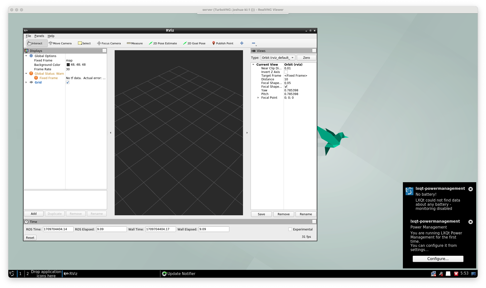

# VirtualGL, TurboVNC, and ROS2 Docker image

Docker hub: [damanikjosh/virtualgl-turbovnc-ros2](https://hub.docker.com/r/damanikjosh/virtualgl-turbovnc-ros2)

This image is based on the [nvidia/opengl](https://hub.docker.com/r/nvidia/opengl) image and adds [VirtualGL](https://www.virtualgl.org/), [TurboVNC](https://www.turbovnc.org/), and [ROS2](https://docs.ros.org/en/galactic/index.html) to it. It is intended to be used as a base image for running graphical ROS2 applications in a Docker container.

## Tags

- `latest`, `iron`: Ubuntu 22.04 with VirtualGL 3.1, TurboVNC 3.1, and ROS2 Iron
- `humble`: Ubuntu 22.04 with VirtualGL 3.1, TurboVNC 3.1, and ROS2 Humble
- `galactic`: Ubuntu 20.04 with VirtualGL 3.1, TurboVNC 3.1, and ROS2 Galactic
- `foxy`: Ubuntu 20.04 with VirtualGL 3.1, TurboVNC 3.1, and ROS2 Foxy

## Pre-requisites

Before you can use this image, you need to install VirtualGL server on the host system. You can follow the instructions [here](https://github.com/damanikjosh/virtualgl-turbovnc-docker/tree/main?tab=readme-ov-file#pre-requisites).

## Usage

You can use this image to run graphical applications in a Docker container. You can use the `vglrun` command to run the graphical applications.


```bash
docker run --gpus all --rm -it --network=host -e DISPLAY=:1 damanikjosh/virtualgl-turbovnc-ros2:latest vglrun rviz2
```

```
You will require a password to access your desktops.

Password: 
Verify:   
Would you like to enter a view-only password (y/n)? n
xauth:  file /root/.Xauthority does not exist

Desktop 'TurboVNC: joshua-ki:1 ()' started on display joshua-ki:1

Starting applications specified in /opt/TurboVNC/bin/xstartup.turbovnc
Log file is /root/.vnc/joshua-ki:1.log

QStandardPaths: XDG_RUNTIME_DIR not set, defaulting to '/tmp/runtime-root'
[INFO] [1709704394.934937411] [rviz2]: Stereo is NOT SUPPORTED
[INFO] [1709704394.935011617] [rviz2]: OpenGl version: 4.6 (GLSL 4.6)
[INFO] [1709704394.972560374] [rviz2]: Stereo is NOT SUPPORTED
```

To access the TurboVNC server, you can use a VNC client to connect to the host system on port `5900 + DISPLAY`. You can use the password you set when you ran the `docker run` command.

[](screenshot.png)

## License

This image is licensed under the [MIT License](LICENSE).